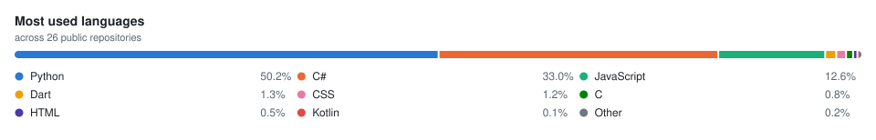

<h1 align="center">Hi, I'm Mahmoud Helmy </h1>

  <a href="https://github.com/Kud0o">
    <picture>
      <source media="(prefers-color-scheme: dark)" srcset="https://readme-typing-svg.demolab.com?font=Fira+Code&weight=500&size=22&pause=1000&color=58A6FF&center=true&vCenter=true&width=560&height=45&lines=Senior+Software+Engineer;Computer+Science+Graduate;Competitive+Programmer;Mobile+%2B+Backend+%2B+AI+Tooling;Systems+that+ship+and+stay+shipped">
      <source media="(prefers-color-scheme: light)" srcset="https://readme-typing-svg.demolab.com?font=Fira+Code&weight=500&size=22&pause=1000&color=0969DA&center=true&vCenter=true&width=560&height=45&lines=Senior+Software+Engineer;Computer+Science+Graduate;Competitive+Programmer;Mobile+%2B+Backend+%2B+AI+Tooling;Systems+that+ship+and+stay+shipped">
      
    </picture>
  </a>

  
  
  
  

  
  
  
  

---

## About

Senior Software Engineer with a computer science background and a competitive programming habit. I work across mobile (Flutter/Dart), backend and enterprise integration (.NET, C#, MSSQL), and Python — and I spend most of my side-project time building developer tooling for AI coding agents.

- 🔭 **Currently building** — developer tooling for AI coding agents: usage/cost instrumentation and multi-agent delegation workflows.
- 🏛️ **Shipped** — E-Invoices integration with a government tax system: document signing, submission, retry/backoff, and reconciliation against a third-party API.
- 💬 **Ask me about** — Flutter & Dart architecture, .NET backends, API integration, algorithms and problem solving.
- 🧩 **Competitive programming** — Codeforces as [`izanagi_0`](https://codeforces.com/profile/izanagi_0); data structures, algorithms, OOP.
- ⚡ **Interested in** — agentic developer tooling, performance work, and clean domain modeling.
- 📫 **Reach me** — [Mail](mailto:mahmoud98398@gmail.com) · [Resume](https://drive.google.com/file/d/1VAGJxn8pUv1835NQ8yWxu7qmZi1enr5V/view?usp=sharing)

---

## Selected work

| Project | What it is | Stack |
|---|---|---|
| [ai-usage-inspector](https://github.com/Kud0o/ai-usage-inspector) | Zero-dependency Claude Code hook that records every prompt and tracks token usage and cost | JavaScript |
| [delegation-management](https://github.com/Kud0o/delegation-management) | Claude Code skill that coordinates two local coding agents over one task queue | Python |
| [Notes](https://github.com/Kud0o/Notes) | Notes app with nested sections and selective PDF export | Flutter · Dart |
| [Mobile-Prediction_ML](https://github.com/Kud0o/Mobile-Prediction_ML) | Mobile app success prediction from store metadata | Python · pandas |
| [Graphical-Geometry-Algorithms](https://github.com/Kud0o/Graphical-Geometry-Algorithms) | Points, lines, polygons and their intersections, with a visual front end | C# |
| [Cores-Parallel-Processing-KMeans](https://github.com/Kud0o/Cores-Parallel-Processing-KMeans) | K-Means clustering parallelised across cores | Python |
| [Qr-Code-Detection-Matlab](https://github.com/Kud0o/Qr-Code-Detection-Matlab) | QR detection, clipping, rotation and cropping from images | MATLAB · OpenCV |
| [Search_Engine](https://github.com/Kud0o/Search_Engine) | Indexing and ranked retrieval engine | C++ |

---

## Tech

**Languages**

  
  
  
  
  
  
  

**Frameworks & platforms**

  
  
  
  
  
  

**Data & infrastructure**

  
  
  
  
  
  

---

## GitHub

  <picture>
    <source media="(prefers-color-scheme: dark)" srcset="metrics.dark.svg">
    <source media="(prefers-color-scheme: light)" srcset="metrics.light.svg">
    
  </picture>

  <picture>
    <source media="(prefers-color-scheme: dark)" srcset="languages.dark.svg">
    <source media="(prefers-color-scheme: light)" srcset="languages.light.svg">
    
  </picture>
  <picture>
    <source media="(prefers-color-scheme: dark)" srcset="metrics.calendar.dark.svg">
    <source media="(prefers-color-scheme: light)" srcset="metrics.calendar.light.svg">
    
  </picture>

  <picture>
    <source media="(prefers-color-scheme: dark)" srcset="snake.dark.svg">
    <source media="(prefers-color-scheme: light)" srcset="snake.light.svg">
    
  </picture>

<!--
  These SVGs are generated by .github/workflows/metrics.yml and committed into this
  repository, so they are served from GitHub itself and cannot break when a third-party
  card service runs out of quota. Regenerated daily; run the workflow manually from the
  Actions tab to refresh on demand.
-->

Language metrics reflect the languages in my public code, not experience or skill level.

